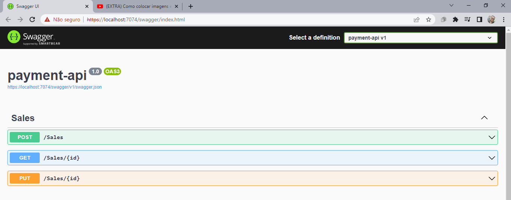
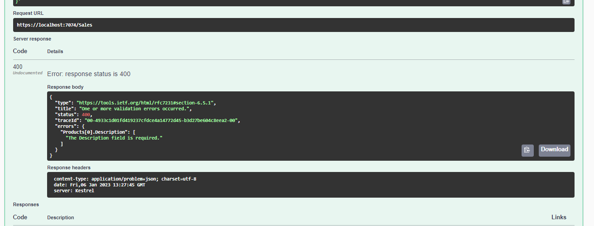
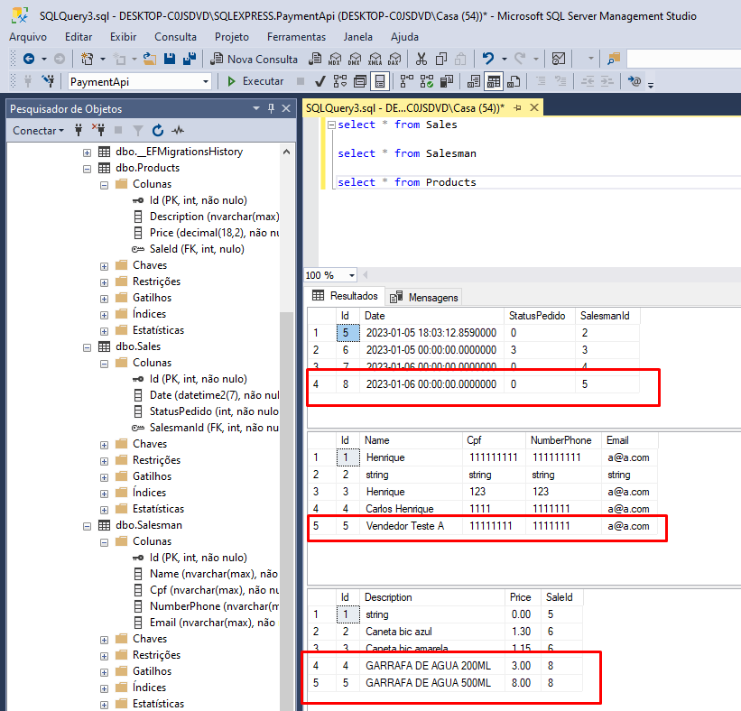

## TESTE TÉCNICO BOOTCAMP POTTENCIAL .NET DEVELOPER

### TÉCNOLOGIAS DA API REST

- Linguagem : .NET
- Framework : Entity Framework
- Banco de dados: SqlServer
- Swagger

### OPERAÇÕES

### REGISTRO DE VENDA

- Validação de pedido sem item

- Registro da venda com sucesso

### CONSULTA DA VENDA

### ATUALIZAÇÃO DE STATUS

- Validação de transição de status

- Validação de transição com sucesso

